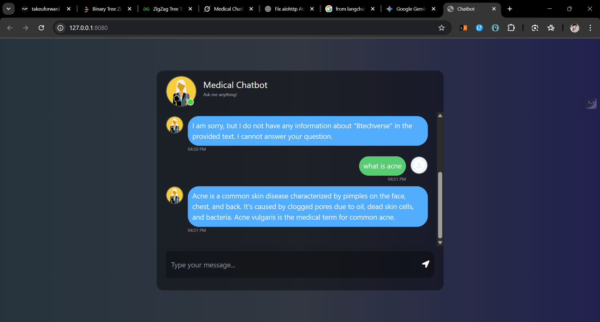

# Medical Chatbot

This project is a Retrieval-Augmented Generation (RAG) based medical chatbot. It uses a large language model to answer questions about medical topics based on a provided medical text. The chatbot is built with Flask and uses Pinecone for vector storage and retrieval.

## Features

-   **Medical Question Answering:** Ask the chatbot any medical question, and it will provide answers based on the knowledge from the provided medical book.
-   **Web Interface:** A simple and intuitive web interface to interact with the chatbot.
-   **RAG Pipeline:** Implements a RAG pipeline using LangChain, which includes:
    -   Loading and splitting a medical PDF document.
    -   Generating embeddings for the text chunks.
    -   Storing and retrieving text chunks from a Pinecone vector store.
    -   Generating answers using a large language model.

## Technologies Used

-   **Backend:** Flask
-   **Frontend:** HTML, CSS, JavaScript, Bootstrap
-   **LLM Orchestration:** LangChain
-   **Vector Store:** Pinecone
-   **Embeddings:** Hugging Face Sentence Transformers (`all-MiniLM-L6-v2`)
-   **LLM:** Google Gemini




## Setup and Installation

1.  **Clone the repository:**

    ```bash
    git clone https://github.com/hello-mr-vishu/rag-kit.git
    cd your-repository-name
    ```

2.  **Create a virtual environment and install dependencies:**

    ```bash
    python -m venv .venv
    source .venv/bin/activate  # On Windows, use `.venv\Scripts\activate`
    pip install -r requirements.txt
    ```

3.  **Set up environment variables:**

    Create a `.env` file in the root directory and add the following:

    ```
    PINECONE_API_KEY="YOUR_PINECONE_API_KEY"
    GEMINI_API_KEY="YOUR_GEMINI_API_KEY"
    ```

4.  **Store the index:**

    Run the `store_index.py` script to process the PDF, create embeddings, and store them in Pinecone:

    ```bash
    python store_index.py
    ```

## Usage

1.  **Run the Flask application:**

    ```bash
    python app.py
    ```

2.  **Open your web browser and go to:**

    ```
    http://127.0.0.1:8080
    ```

3.  **Start chatting with the medical chatbot!**

## Project Structure

```
.
├── app.py              # Flask application
├── data
│   └── Medical_book.pdf # Medical document
├── requirements.txt    # Python dependencies
├── setup.py            # Setup script
├── src
│   ├── helper.py       # Helper functions for data processing
│   └── prompt.py       # System prompt for the LLM
├── static
│   └── style.css       # CSS for the web interface
├── store_index.py      # Script to create and store the vector index
└── templates
    └── chat.html       # HTML template for the chat interface
```

